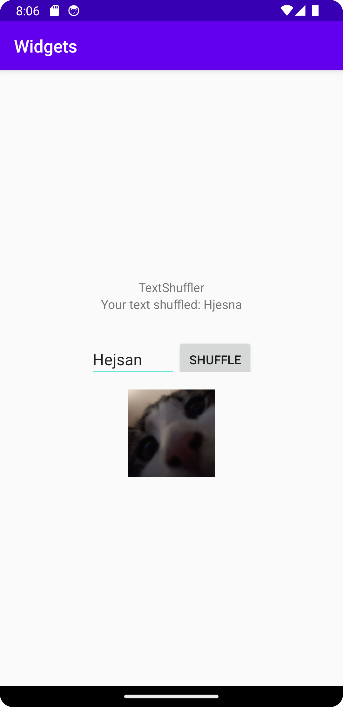

# Rapport
Det lilla projektet började med att lägga till LinearLayout och en TextView till activity_main.xml. LinearLayout sattes till vertikal för att "stacka" elementen vertikalt.  
Sedan lades det till en Button widget och en EditText widget till xml-filen. Båda widgets fick en marginTop på 20 px för att ge appen utrymme.  
I java-filen lades det därefter till en onClick-funktionalitet för att använda knappen.  
För att testa och se så att knappen gjorde något i själva appen skapades en shuffle-metod som shufflar den tänkta texten som skrivs in i EditText-widgeten när knapp-widgeten trycks.     
Det gör den genom att när knappen trycks ned tar den värdet i EditText, randomiserar varje karaktärs position, och sedan sätter värdet i TextView-widgeten till det nya "shufflade" värdet.  
Efter det lades det till en LinearLayout som stackade EditText och Button horisontellt istället för vertikalt.  
Och sedan gjordes det så att båda LinearLayout:sen som nu finns är centrerade i skärmen.  
Lade slutligen till en ImageView widget med en bild på en katt för att vara säker på att tre olika widgets använts i projektet.  

# Kod
```
@Override
    protected void onCreate(Bundle savedInstanceState) {
        super.onCreate(savedInstanceState);
        setContentView(R.layout.activity_main);
        Button b = findViewById(R.id.myShflBtn);

        b.setOnClickListener(new View.OnClickListener() {
            @Override
            public void onClick(View view) {
                Log.d("==>", "Button clicked");
                TextView textViewToShuffle = (TextView) findViewById(R.id.textToShfl);
                EditText myNewEditText = (EditText) findViewById(R.id.myNewEdt);
                String textFromEditText = myNewEditText.getText().toString();
                textViewToShuffle.setText("Your text shuffled: " + shuffler(textFromEditText));
            }
        });
    }

    public String shuffler(String textToShuffle) {
        List<Character> charactersToShuffle = new ArrayList<>();

        for (char i : textToShuffle.toCharArray()) {
            charactersToShuffle.add(i);
        }

        Collections.shuffle(charactersToShuffle);

        StringBuilder backToString = new StringBuilder();
        for (char i : charactersToShuffle) {
            backToString.append(i);
        }

        return backToString.toString();
    }
```
Kod som hittar Button-widgeten med sitt id och sätter en OnClickListener på den. Sedan använder den sig av OnClick för att shuffla värdet på EditText och sätta det till värdet på TextView.  
Shuffler är en metod som gör om alla karaktärer i en given string till element i en array. Sedan använder den sig av Collections.shuffle för att "shuffla" värdenas position i arrayen.  
Slutligen används StringBuilder för att sätta tillbaka elementen i arrayen till en string som returnas.  

# Bild på appen

